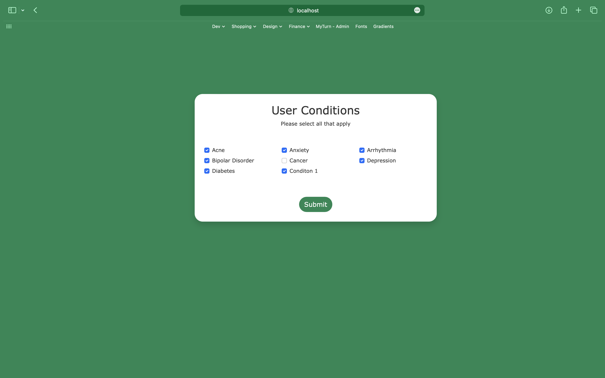

# README



### Prepare Application

```bash
bundle && rails db:create db:migrate db:seed
```

### Run Application

```bash
foreman start
```

### Available Admin Features

[Open Sidekiq Dashboard](locahost:3000/sidekiq)

[Open Admin Dashboard](locahost:3000/admin)

### Notes

For testing purposes, it will be requested to update onboarding info every 2 minutes, you can change this in `config/schedule.yml`.

You can create new conditions and symptoms in the [Admin Dashboard](locahost:3000/admin).

It was used `devise` for authentication feature. I did not set password recovery, account confirmation and account locking and unlocking for this test, since it was not the focus of the challenge.

It was used `rails_admin` for the admin dashboard.

It was used `sidekiq-cron` for the cron workers.

It was used `activerecord-import` to save all the users conditions and question answers with a single query.